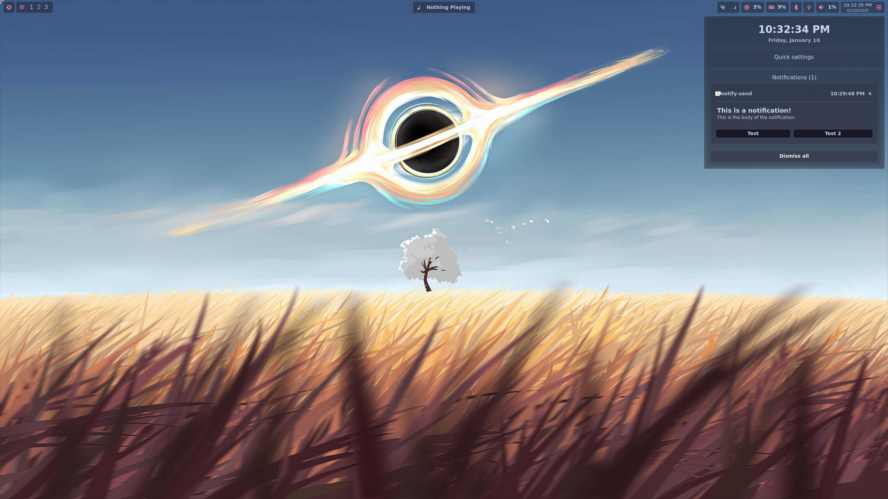

My NixOS configuration. Probably really wrong in many ways, but it works for me.

Inspired by the following configurations and resources:
- https://github.com/Misterio77/nix-starter-configs
- https://nixos-and-flakes.thiscute.world/
- https://github.com/0thElement/nixconf
- https://github.com/georgewhewell/nixos-host
- https://github.com/dreamsofcode-io/dotfiles
- https://github.com/XNM1/linux-nixos-hyprland-config-dotfiles
- https://github.com/end-4/dots-hyprland
- https://github.com/Serpentian/AlfheimOS
- https://github.com/Jas-SinghFSU/HyprPanel/tree/master
- https://github.com/SoraTenshi/nixos-config
- https://github.com/RoccoRakete/hyprland-dots
- https://github.com/fufexan/dotfiles
- https://github.com/justinmdickey/publicdots/tree/main

# Features
- Custom hyprland theme
- Custom wallpaper manager that changes and animates the wallpaper hourly
- Custom lockscreen with hyprlock
- Custom widgets using astal:
  - Custom bar
  - Custom launcher that supports applications, Rink formulas, shell commands, dictionary lookup, web searches, and symbols
  - Custom notifications
  - Media controls with Cava audio visualizer
  - Controls menu with notifications, quick settings (TODO), and a calendar (currently broken with GTK4)
- A variety of applications installed and configured in a modular, per-machine, way.
- Custom boot splash screen
- (Mostly working) Nvidia support!
- NixOS configuration shared between multiple machines
- ...and probably a bunch of other stuff I'm forgetting

# Images

